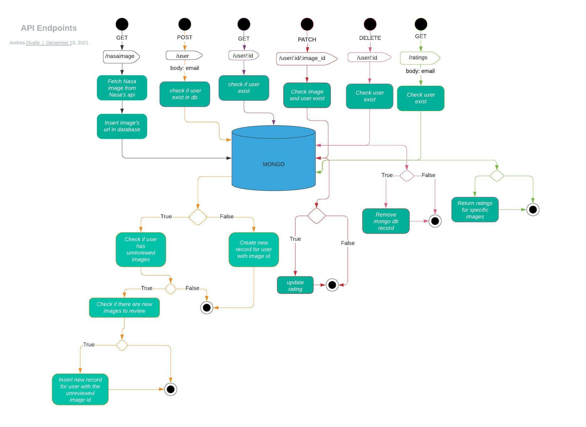

# Rate Nasa's astronomy picture of the day !

The following api will allow you to save and rate Nasa's astronomy picture of the day per user. You will be able to do the following:

1) Fetch from Nasa's APOD api and save image into a local database
2) Create and delete users and image specific ratings (1-5)
3) Get user information (ratings, email)
4) Get total user ratings per image

### How to run the api:
1) Get a api key token from -> https://api.nasa.gov/index.html
2) clone this repo
3) travel to the root folder and create an ```.env``` file with the following env variables

```
APP_ENV=production
API_HOST=localhost
PORT=3000
API_TOKEN="your_api_token"
MONGO_HOST='mongodb://mongo:27017/labelbox'
```
4) Run  ```docker-compose up -d ``` on the root folder 

Note: You do not need to initialize a mongo db separately, the docker-compose uses a mongo image to create the database within the container.


### Endpoints:

1) ```/nasaimage```: Fetches and saves a nasa image of the day in a mongo db

*  ```[GET] /api/nasaimage```

2) ```/user/:id```: Gets user by mongo record id

*  ```[GET] /api/user/61bfb7359158437ec6634c51```

[200] Response:

```json
{
    "success": true,
    "item": [
        {
            "_id": "61bfb7359158437ec6634c51",
            "email": "test@gmail.com",
            "image_id": "61bfb00193bcd5e95424ce93",
            "rating": 0,
            "createdAt": "2021-12-19T22:50:29.101Z",
            "updatedAt": "2021-12-19T22:50:29.101Z",
            "__v": 0
        }
    ]
}
```

3) ```/user```: creates user and inserts image of the day to the user record

*  ```[POST] /api/user```

Request body:

```json
    {
        "email": "test@gmail.com"
    }
```
[200] Response:

```json
{
    "success": true,
    "item": {
        "email": "test@gmail.com",
        "image_id": "61bfb00193bcd5e95424ce93",
        "rating": 0,
        "_id": "61bfb7359158437ec6634c51",
        "createdAt": "2021-12-19T22:50:29.101Z",
        "updatedAt": "2021-12-19T22:50:29.101Z",
        "__v": 0
    }
}
```
4) ```/user/:id/:image_id```: Updates the rating for the user and a specific image

*  ``` [PATCH] /api/user/61bfb7359158437ec6634c51/61bfb00193bcd5e95424ce93```

[200] Response:

```json
{
    "success": true,
    "item": {
        "rating": 3
    },
    "writeOpResult": {
        "_id": "61bfb7359158437ec6634c51",
        "email": "test@gmail.com",
        "image_id": "61bfb00193bcd5e95424ce93",
        "rating": 3,
        "createdAt": "2021-12-19T22:50:29.101Z",
        "updatedAt": "2021-12-19T22:54:41.666Z",
        "__v": 0
    }
}
```

5) ```/user/:id```: Deletes the records of unique user and the corresponding image of the day

* ```[DELETE] /api/user/61bfbba7702453981c689486```

[200] Response:

```json
{
    "success": true,
    "item": {
        "_id": "61bfbba7702453981c689486",
        "email": "test2@gmail.com",
        "image_id": "61bfb00193bcd5e95424ce93",
        "rating": 0,
        "createdAt": "2021-12-19T23:09:27.562Z",
        "updatedAt": "2021-12-19T23:09:27.562Z",
        "__v": 0
    },
    "message": "User has been deleted"
}
```

6) ```/ratings```: Fetches the ratings for a specific user and specific image must pass
 the user data in the request.

* ```[GET] /ratings```

Request body:

```json
    {
        "email" : "test@gmail.com"
    }
```

[200] Response:

```json
{
    "success": true,
    "images": {
        "61bfb00193bcd5e95424ce93": 3
    },
    "user": "test@gmail.com",
    "message": "User ratings per image has been retrieved"
}
```
## API UML


